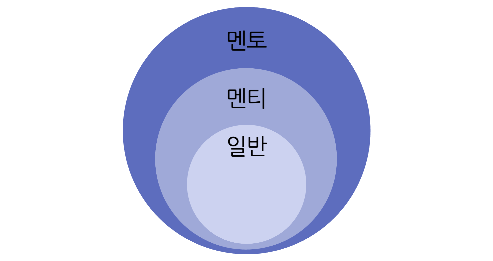

# 💁🏻‍♂️ 소개

  

[CODI (Co-disabled)](https://codisabled.com)

☝🏻 CODI(Co-Disabled)는 together의 축약어인 CO와 장애인이라는 뜻의 DISABLED의 합성어로, 장애인 멘티와 멘토가 함께 만들어 가는 멘토링 플랫폼 서비스입니다.

☝🏻 CODI 는 **제 2회 고용노동 공공데이터 활용 공모전** 에 출품하여 장려상을 받았습니다.

☝🏻 다양한 경로로 피드백을 수집하여 지속적으로 개발 및 운영 중입니다. :) 아래 이메일로
codinator.info@gmail.com

# 🌟 기능

## 🔎 사용자의 분류

> CODI 의 **사용자** 는 장애, 직무 에 관한 정보를 포함한 프로필 작성 유무에 따라 **일반**, **멘티**, **멘토** 세 가지로 나뉩니다.

- **일반** 은 회원 가입 후, 프로필을 작성하지 않은 상태입니다. 멘토 프로필 만 열람할 수 있습니다.
- **멘티** 는 기본적인 정보를 포함한 멘티 프로필을 작성한 상태입니다.
- **멘토** 는 멘티 프로필에서 추가적인 정보를 포함한 멘토 프로필을 작성한 상태 입니다.

## 📂 프로필

💡 **프로필** 은 **사용자** 의 장애와 직무 관한 데이터를 나타냅니다. 이는 멘토/직무 추천, **멘토링** 신청 기능에 사용됩니다. 또한, **사용자** 의 분류를 나누는 기준이 됩니다.

- **멘티** **프로필**
  - 다른 **사용자** 가 열람 불가 ❌
  - **멘티** 가 **멘토링** 을 신청한 **멘토** 만 **멘티** 의 **프로필** 을 열람 가능 🟢
- **멘토** **프로필**
  - 모든 분류의 **사용자** 가 열람 가능 🟢
  - **멘티** **프로필** 의 일부 데이터(나이, 장애구분, 중증도)가 자동적으로 포함 됨
  - 멘토링 횟수와 멘토링 신청 응답률 제공

## 💬 멘토링

💡 멘토링 은 멘티와 멘토 1:1 로 멘토 가 생성한 **스케줄** 에 지정한 플랫폼에서 진행됩니다. 다음과 같은 순서로 진행됩니다.

1. **스케줄** 생성 및 수정 (스케줄 은 멘토링이 진행될 날짜 와 시간 을 나타냅니다.)

   - **멘토** 는 **멘토링** 이 가능한 날짜 와 시간을 **스케줄** 로 등록
   - 자신이 등록한 스케줄 을 수정 및 조회(월별, 일별) 가능

2. 멘토링 신청
   - **멘티** 는 **멘토** 프로필 에서 멘토링을 신청
   - **멘토** 는 **멘토링** 요청 수락 또는 거절
3. 멘토링 수락 시
   - **멘토** 는 **멘토링** 을 진행할 플랫폼(Discord, Google Meet, Zoom) 의 링크를 등록
   - **멘티** 는 수락된 **멘토링** 조회 가능
   - **멘티** 와 **멘토** 는 플랫폼에서 멘토링 진행

## 👍🏻 추천

- 약 37,000개의 장애인 취업 정보 데이터 기반으로 상위 3개의 직무 추천
- 사용자의 희망 직무, 추천 받은 직무, 장애 유형 등 주요 데이터에 가중치를 적용해 개인화된 멘토를 추천

## 🌐 멘토 찾기

- 멘토 들의 프로필 조회
- 장애 유형, 직무, 경력, 멘토 이름, 자기소개 내용을 기반으로 입력된 키워드 단위의 검색 가능
- 관심있는 멘토 지정 가능

## ✨ 접근성

_업데이트 예정_

# 👥 팀원 소개

|                                            UX                                             |                                            PM                                             |                                            FE                                             |                                            BE                                             |
| :---------------------------------------------------------------------------------------: | :---------------------------------------------------------------------------------------: | :---------------------------------------------------------------------------------------: | :---------------------------------------------------------------------------------------: |
|  |  |  |  |
|                                          윤지숙                                           |                                          장보민                                           |                         [오현재](https://github.com/hangooksaram)                         |                          [변찬중](https://github.com/chaning49)                           |

# 📊 ERD 설계

# 🔧 기술 스택

## Backend

- Java 11
- Spring
  - Boot
  - Data JPA
  - Security
- QueryDSL
- JWT
- MySQL
- Swagger
- AWS

## Frontend

- Javascript
- Typescript
- React 18
- Next 13
- React Query
- Emotion
- Vercel

# 🔌 구조

